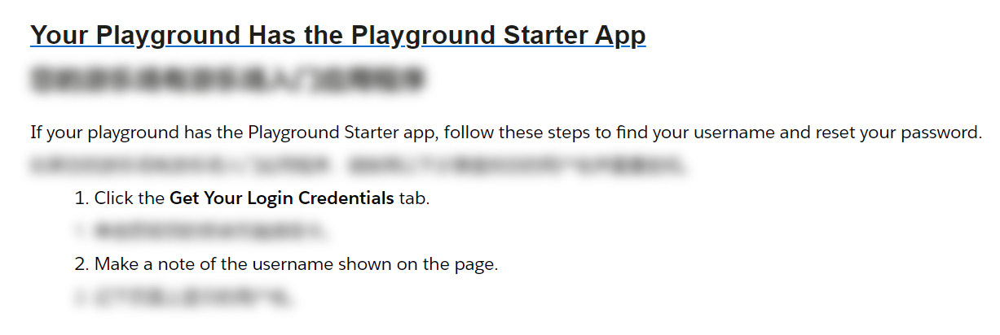

- [任务1.学习Apex,Trigger,以及对象字段的简单使用](#任务1学习apextrigger以及对象字段的简单使用)
  - [Trigger](#trigger)
  - [学习Apex](#学习apex)
    - [List](#list)
- [任务2.学习Visualforce 页面的开发,能够做出与后台交互的Visualforce页面](#任务2学习visualforce-页面的开发能够做出与后台交互的visualforce页面)
  - [visualforce生成PDF](#visualforce生成pdf)
    - [踩坑记录](#踩坑记录)
  - [apex:pageBlockButtons 样式调整,修改前：](#apexpageblockbuttons-样式调整修改前)
  - [修改后](#修改后)
    - [代码](#代码)
  - [官网解释：](#官网解释)
- [任务3.学习Salesforce内的一些配置功能,如Flow、验证规则、重复\&匹配规则、审批流的配置等](#任务3学习salesforce内的一些配置功能如flow验证规则重复匹配规则审批流的配置等)
  - [三种常规类型的流(Flow)](#三种常规类型的流flow)
  - [三种类型的触发器(Trigger)](#三种类型的触发器trigger)
  - [验证规则（Validation Rules）](#验证规则validation-rules)
  - [重复\&匹配规则（Duplicate \& Matching Rules）](#重复匹配规则duplicate--matching-rules)
  - [审批流程（Approval Processes）](#审批流程approval-processes)
  - [official reference：](#official-reference)
- [任务4.学习Apex中的主要异步操作 1.定时作业（Scheduled Job）、2.批处理(Batch)、3.异步方法(Future) 等](#任务4学习apex中的主要异步操作-1定时作业scheduled-job2批处理batch3异步方法future-等)
  - [1.ScheduledApex](#1scheduledapex)
  - [2.实现批处理类步骤明确，只需要执行以下的步骤：](#2实现批处理类步骤明确只需要执行以下的步骤)
  - [3.Future方法用于异步处理，常用于Web service callout操作.](#3future方法用于异步处理常用于web-service-callout操作)
    - [QA](#qa)
      - [什么是 Batch？Batch 能用来处理什么问题？](#什么是-batchbatch-能用来处理什么问题)
      - [为什么处理大批量数据就要用 Batch？](#为什么处理大批量数据就要用-batch)
      - [如何启用 Batch？如何设置批次？](#如何启用-batch如何设置批次)
      - [Batch 分哪几个模块？分别实现什么功能？](#batch-分哪几个模块分别实现什么功能)
      - [Database.query() 最多只能查询 50000 条数据，如果我要处理的数据超出 50000 条怎么办？](#databasequery-最多只能查询-50000-条数据如果我要处理的数据超出-50000-条怎么办)
- [任务5.学会日志打印,根据日志排查与问题](#任务5学会日志打印根据日志排查与问题)
  - [reference](#reference)
  - [日志](#日志)
    - [打印日志](#打印日志)
    - [查看日志：](#查看日志)
  - [测试](#测试)
    - [验证结果](#验证结果)
    - [区分测试边境](#区分测试边境)
    - [测试 Visualforce Controllers](#测试-visualforce-controllers)
    - [测试 Private 变量和方法](#测试-private-变量和方法)
      - [reference here](#reference-here)
- [vscode 配置](#vscode-配置)
  - [prettier--代码格式化工具，](#prettier--代码格式化工具)
- [playground登录迷思](#playground登录迷思)

# 任务1.学习Apex,Trigger,以及对象字段的简单使用
##  Trigger
 > 可以在事件发生之前或之后对Salesforce中的记录（例如插入，更新或删除）执行自定义操作。就像数据库系统支持触发器一样，Apex也提供触发器支持来管理记录。

1.before被用于更新或验证记录值之前，将其保存到数据库之前

2.after用于访问系统设置的字段值，并影响其他记录中的更改。触发after触发器的记录是只读的
## 学习Apex
### List
在 Salesforce Apex 中，List 是一个动态大小的集合，用于存储各种类型的数据。虽然 List 没有固定的长度限制，但它受到 Salesforce 平台限制和资源约束的影响。

在 Apex 中，List 的大小受到堆内存（heap memory）限制的影响。堆内存限制取决于你的 Apex 代码是在同步环境中执行（比如触发器、Visualforce 控制器等）还是在异步环境中执行（比如批处理类、排程类等）。

以下是 Salesforce Apex 堆内存限制的一些示例：

- 同步事务：6 MB
- 异步事务：12 MB

例如，如果你在 Apex 触发器中使用 List<Vendor__c>，那么初始化和操作该列表时，堆内存限制为 6 MB。要注意，这个限制不仅仅适用于 List，还适用于整个事务中的所有变量和数据结构。

为避免在运行时遇到内存限制，建议采用以下最佳实践：

- 只在需要时初始化和使用 List，避免在整个事务中不必要地占用内
- 存。
- 当可能时，使用批处理 Apex 和其他异步操作来处理大量数据，以减轻内存限制。
- 限制对大型 List 的操作，避免在循环中执行消耗大量内存的操作。
  
# 任务2.学习Visualforce 页面的开发,能够做出与后台交互的Visualforce页面

## visualforce生成PDF
- reference：https://www.cnblogs.com/luqinghua/p/9326665.html
### 踩坑记录
Q:Attempt to de-reference a null object

A:从 Opportunity 对象中获取 Description 字段的操作。如果你的查询没有找到任何 Opportunity 对象，或者找到的 Opportunity 对象的 Description 字段为 null，那么在尝试对 Description 字段进行操作时，就会出现这个错误。

可以通过在使用 Description 字段之前检查它是否为 null 来解决这个问题。如果它为 null，你可以选择跳过对它的操作，或者给它赋一个默认值

```java
public void spliteString(String s){
    if (s != null) {
        Index++;
        IndexList.add(String.valueOf(Index));
        List<String> str = s.split('\n');
        List<String> str_temp;
        List<List<String>> sTable = new List<List<String>>();
        for(String tr:str){
            str_temp = new List<String>();
            for(Integer i=0;i<tr.length();i++){
                str_temp.add(tr.subString(i,i+1));
            }
            sTable.add(str_temp);
        }
        ContentList.add(sTable);
        ContentMap.put(String.valueOf(Index),sTable);
    }
}
```
## apex:pageBlockButtons 样式调整,修改前：

## 修改后

### 代码
```xml
<apex:pageBlockButtons location="bottom">
```
## 官网解释：
> location	String	The area of the page block where the buttons should be rendered. Possible values include "top", "bottom", or "both". If not specified, this value defaults to "both".
应呈现按钮的页面块区域。可能的值包括“顶部”、“底部”或“两者”。如果未指定，则此值默认为“两者”。
Note: If a pageBlock header facet is defined, the facet overrides the buttons that would normally appear at the top of the page block. Likewise, if a pageBlock footer facet is defined, the facet overrides the buttons that would normally appear at the bottom of the page block.
注： 如果定义了页面块标题分面，则该分面将覆盖通常显示在页面块顶部的按钮。同样，如果定义了 pageBlock 页脚分面，则该分面将覆盖通常显示在页块底部的按钮。

# 任务3.学习Salesforce内的一些配置功能,如Flow、验证规则、重复&匹配规则、审批流的配置等
## 三种常规类型的流(Flow)
| Flow Type         | Launched By                     | Description                                                                                                            |
| ----------------- | ------------------------------- | ---------------------------------------------------------------------------------------------------------------------- |
| Screen Flow       | Quick action                    | Screen Flows provide a UI that guides users through a business process\.                                               |
|                   | Lightning page                  | 屏幕流提供指导用户完成业务流程的 UI。                                                                                  |
|                   | Experience Cloud site, and more |                                                                                                                        |
|                   |                                 |                                                                                                                        |
| Autolaunched Flow | Another flow                    | Autolaunched Flows automate business processes that have no UI\. They have no trigger and they run in the background\. |
|                   | Apex code                       | 自动启动的流程可自动执行没有 UI 的业务流程。它们没有触发器，在后台运行。                                               |
|                   | REST API                        |                                                                                                                        |
|                   |                                 |                                                                                                                        |
| Triggered Flow    | Time                            | Triggered Flows are autolaunched by a trigger you specify\. They run in the background\.                               |
|                   | Data change                     | 触发的流由您指定的触发器自动启动。它们在后台运行。                                                                     |
|                   | Platform event                  |

## 三种类型的触发器(Trigger)
| Trigger Type   | When It Runs                                         | How To Use It                              |
| -------------- | ---------------------------------------------------- | ------------------------------------------ |
| Schedule       | At A Time And Frequency You Specify                  | Running Nightly Batch Jobs                 |
| Platform Event | When A Particular Platform Event Message Is Received | Subscribing To Events                      |
| Record         | When A Record Is Created, Updated, Or Deleted        | Updating Records And Sending Notifications |

## 验证规则（Validation Rules）

验证规则是在保存记录时对数据进行验证的一种方法。通过创建验证规则，您可以确保用户在保存记录时输入的数据满足特定条件。验证规则可以用于确保必要字段的填写，或者确保输入数据符合业务逻辑。当用户输入的数据不符合验证规则时，系统将显示一个错误消息，并阻止记录的保存。

创建验证规则的步骤如下：

- 登录Salesforce并进入设置。
- 在设置中，选择“对象管理”并找到需要添加验证规则的对象。
- 单击“验证规则”，然后单击“新建验证规则”按钮。
- 在“验证规则编辑”页面上，为规则命名，并输入验证公式。公式应返回一个布尔值（真或假）。如果返回值为真，系统将显示错误消息并阻止记录的保存。
- 输入错误条件公式、错误消息和错误位置。
- 保存规则。
## 重复&匹配规则（Duplicate & Matching Rules）

重复和匹配规则用于检测和防止记录重复。这些规则通过将新记录与现有记录进行比较来识别潜在的重复。匹配规则定义了如何比较两个记录以确定它们是否相似。重复规则则定义了在检测到重复时应采取的操作。

创建重复和匹配规则的步骤如下：

- 登录Salesforce并进入设置。
- 在设置中，选择“数据管理”并找到“重复和匹配规则”选项。
- 首先，创建匹配规则。单击“匹配规则”选项卡，然后单击“新建匹配规则”按钮。为规则命名，选择对象，并定义匹配条件。保存规则。
- 接下来，创建重复规则。单击“重复规则”选项卡，然后单击“新建重复规则”按钮。为规则命名，选择对象，并指定要使用的匹配规则。定义在检测到重复时应采取的操作，例如警告用户或阻止记录的保存。
- 保存规则。
## 审批流程（Approval Processes）

审批流程是一种自动化流程，用于控制记录的审批。它可以确保记录在符合特定条件的情况下才能获得相关人员的批准。审批流程涉及到审批者、提交者、审批步骤、审批动作和审批条件。

创建审批流程的步骤如下：

- 登录Salesforce并进入设置。- 
- 在设置中，选择“流程自动化”并找到“审批流程”选项。- 
- 选择要创建审批流程的对象，然后单击“新建审批流程”按钮。- 
- 为审批流程命名并提供描述。设定入口条件，以便仅在满足特定条件时触发审批流程。- 
- 定义审批步骤。审批步骤是审批流程的阶段，每个阶段都有一个或多个审批者。您可以设置审批者是具体用户、角色或共享规则。同时，可以定义每个审批步骤的审批条件。- 
- 定义审批动作。审批动作可以在审批流程的各个阶段触发，例如当记录被批准、拒绝或回退时。审批动作可以包括更新字段、发送电子邮件通知或触发其他自动化流程。- 
- 对于每个审批步骤，您还可以设置提醒和超时，以确保审批者在规定时间内完成审批。- 
- 保存审批流程，并在需要时激活。

## official reference：
> https://trailhead.salesforce.com/zh-CN/content/learn/modules/record-triggered-flows/get-started-with-triggered-flows?trailmix_creator_id=strailhead&trailmix_slug=wt23-automate-with-flow

# 任务4.学习Apex中的主要异步操作 1.定时作业（Scheduled Job）、2.批处理(Batch)、3.异步方法(Future) 等
##   1.ScheduledApex
通过以下步骤即可完成操作：

　　1.实现Schedulable接口，并重写execute方法，此方法体内实现需要定时执行的操作;

　　2.使用System.schedule()方法实现定时任务的调用。

　　Schedulable接口代码举例如下：
```java
public class GoodsSchedule implements Schedulable {
    //execute方法内为需要执行的定时任务
    public void execute(SchedulableContext sc) {
        String queryString = 'select Id,GOODSNAME__c from GOODS__c';
        SimpleBatchUtil batchUtil = new SimpleBatchUtil(queryString);
        Database.executeBatch(batchUtil);
    }
}
```

##   2.实现批处理类步骤明确，只需要执行以下的步骤：

1.实现Database.Batchable接口;

2.实现start()方法，此方法中通常写查询语句，并将数据通过Database.getQueryLocator(queryString)方法将数据传递到execute()形参中。此方法定义：

```java
global (Database.QueryLocator | Iterable<sObject>) start(Database.BatchableContext bc) {} ;
```

3.实现execute()方法，此方法对数据进行DML操作。此方法定义：
```java
global void execute(Database.BatchableContext BC, list<P>){} ;
```
4.实现finish方法(),此方法进行后期处理，如果无需要处理，可以不进行处理。
  
##   3.Future方法用于异步处理，常用于Web service callout操作.
###  QA
#### 什么是 Batch？Batch 能用来处理什么问题？

答：Batch 即批处理，用来处理大批量数据。

#### 为什么处理大批量数据就要用 Batch？

答：
1. 因为 Salesforce 对每个事务有 SQL 的 DML 限制，CPU Time Out，内存超限等限制，直接处理大批量数据会导致超限。
2. Batch 分批次处理时，每个批次是不同的事务，单独计算 DML 数量等，所以可以很大程度上避免超限。

#### 如何启用 Batch？如何设置批次？

```java
Database.executeBatch(new TestBatch());// 不设置批次数量时，默认按每批次 200 条记录执行
Database.executeBatch(new TestBatch(), 3000);// 设置每批次执行 3000 条记录，但实际上每批次只会执行 2000 条，因为批次最多只能设为 2000，超过 2000 按 2000 计算
```

#### Batch 分哪几个模块？分别实现什么功能？

1. start：用来查询要处理的数据总数（只执行一次）
2. execute：批处理核心方法，执行主体逻辑（执行多次）
3. finish：批处理全部运行完后执行的方法，一般用来把 Batch 错误信息发送邮件给指定用户，如把 Batch 中的错误信息发送给管理员，或把 Batch 执行完毕的消息发动给当前用户（只执行一次）

#### Database.query() 最多只能查询 50000 条数据，如果我要处理的数据超出 50000 条怎么办？

可以使用 `Database.getQueryLocator()` 方法，最多返回 5000 万条记录。

  Future方法需要有几个规范：

   1).方法必须是静态static的;

　　2).方法上方需要使用@Future标签;

　　3).方法返回类型必须是void类型;

　　4).方法参数必须是模块私有的变量，不能使public等;

　　5).方法参数不允许使用标准的Object或sObject类型，可以使用基本类型或者集合类型;

　　6).不能再一个future方法调用另一个future方法，当future方法运行的时候也不可以在trigger中调用;

　　7).future方法中不能使用getContent()和getContentAsPDF()方法。
>getContent() 和 getContentAsPDF() 方法在 Salesforce Apex 中属于同步调用，这意味着在请求处理过程中，执行会暂停，直到这些方法完成操作并返回结果。这种行为可能导致阻塞和性能问题，特别是在处理大量请求或需要较长时间才能完成的操作时。
future 方法被设计为处理异步操作，它允许将操作放入队列以在后台执行，从而避免阻塞或影响其他进程。因此，future 方法不支持同步调用，如 getContent() 和 getContentAsPDF()，因为这些方法可能导致阻塞或延迟，违反了 future 方法的异步设计原则。

    测试future方法在Test类中执行，和普通的方法测试区别的是，future方法执行需要在Test.startTest()和Test.stopTest()方法中进行.以下为测试代码：

```java
@isTest
private class Test_FutureSample {
    static testMethod void myUnitTest() {
        Test.startTest();
        List<ID> ids= new ID[]{'0012800000Hz6ozAAB','0012800000Hz6oxAAB'};
        FutureSample.futuremethod(ids);
        Test.stopTest();
    }
}
```
# 任务5.学会日志打印,根据日志排查与问题
## reference 
- https://trailhead.salesforce.com/content/learn/projects/find-and-fix-bugs-with-apex-replay-debugger/apex-replay-debugger-launch-playground
- 启用跟踪标志后，Apex 代码将生成调试日志，这些日志是事务中所有交互的记录。Apex 重播调试器使用调试日志模拟实时调试会话。它显示记录的信息，包括变量值、调用堆栈和断点，类似于交互式调试器

> Apex Replay Debugger是一个免费工具，允许您通过使用Visual Studio Code作为客户端检查调试日志来调试Apex代码。运行重播调试器可提供您期望从其他调试器获得的相同功能。您可以查看变量、设置断点以及将鼠标悬停在变量上以查看其当前值。您不再需要手动解析数千个日志行或用语句填充 System.debug 代码来查看变量值或跟踪代码执行路径。

即在console里面查看log转换到vscode调试
## 日志
### 打印日志
在代码中使用 System.debug() ：

在 Apex 代码中，你可以使用 System.debug() 方法在代码的关键点输出有关变量、对象、异常或其他信息的日志。
你还可以指定日志级别，例如：

```java
System.debug(LoggingLevel.ERROR, 'This is an error message');
```
### 查看日志：

在 Salesforce 开发者控制台（Developer Console）中，你可以查看执行 Apex 代码时生成的日志。你还可以使用设置日志级别来过滤日志信息，只显示你关心的部分。

若要查看日志，请打开开发者控制台，然后执行你的 Apex 代码。在“日志”选项卡下，你可以找到所有生成的日志。
分析日志以排查问题：

在查看日志时，你需要关注以下几点：

- 查找 System.debug() 打印的信息，以了解代码执行过程中的变量值、状态等。
- 注意日志中的异常（Exception）或错误（Error）信息，它们可以帮助你定位问题所在。
- 观察代码执行的顺序，确保它按预期的顺序执行。
- 关注性能问题，如执行时间、查询数量等。
## 测试
### 验证结果
```java
System.assert();  
System.assertEquals();  
System.assertNotEquals();  
```
通过 assert 来保证代码输出的结果是业务逻辑需要的值。这样在代码部署后，如果再加新代码，原有测试代码就可以很容易的帮忙检查新代码有没有破坏旧代码，就不需要再浪费时间把原来的逻辑再测试一遍。
### 区分测试边境
使用 Test.startTest() 和 Test.stopTest() 把测试数据和要测试的代码区分开发。也就是在 startTest() 前面创建测试数据，在 startTest() 和 stopTest() 中调用要测试的代码，在 stopTest() 后，使用 assert 去验证测试结果。
### 测试 Visualforce Controllers
- 使用 Test.setCurrentPage() 分配一个模拟的 VF page 去测试 controller 中的 - ApexPages.CurrentPage()。
- 设置 HTTP 的参数，让 controller 可以获取到 URL 中的参数。
- 验证页面的跳转结果
```java
PageReference myPage = Page.MyPage;  
myPage.getParameters().put('id', acc.Id);  
Test.setCurrentPage(myPage);

MyPageController controller = new MyPageController();  
```
### 测试 Private 变量和方法
@TestVisible 可以让 class 中的 private 变量和方法可以在 test class 中访问。
#### reference here
- http://blog.meginfo.com.cn/how-to-write-good-apex-test-methods/
- https://www.cnblogs.com/zero-zyq/p/5474874.html

# vscode 配置
- Salesforce Core Configuration设置Detect Conflicts At Sync : on,可以在上传前检测冲突，上传需用comment而非鼠标右键操作（可能失效）
- 国内参考：https://juejin.cn/post/7094879891325190180
## prettier--代码格式化工具，
- 相关配置参考：https://salesforce.stackexchange.com/questions/320884/use-prettier-in-vs-code-to-format-visualforce
- VF配置：https://github.com/forcedotcom/salesforcedx-vscode/issues/3383
# playground登录迷思
vscode认证时如何找到用户名：https://trailhead.salesforce.com/help?article=Find-the-username-and-password-for-your-Trailhead-Playground

